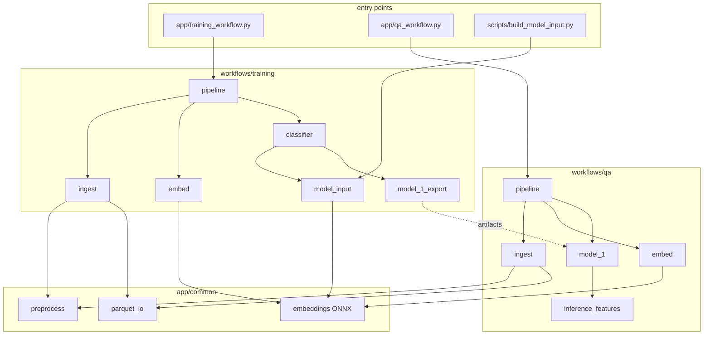

# ODM QA pipeline — system architecture

Two **independent workflows** live under `app/workflows/`. They share only **`app/common/`** (I/O, preprocessing, ONNX encoder, timing, inference-matrix builder, training run reports). **Training code never imports QA code, and vice versa.**

## Layout

```
app/
  bootstrap.py                 # sys.path helper
  qa_workflow.py               # entry point: QA workflow
  training_workflow.py         # entry point: training workflow
  common/                      # shared primitives (not a workflow)
    config/columns.py          # EMBED_COLS, ML_TABULAR_COLS, TARGET_COL, IF_ERROR_COL, …
    config/embedding.py        # ONNX model knobs
    config/paths.py            # PROJECT_ROOT
    features/preprocess.py     # IS_ODM, EXECUTION_ROW_COUNT, …
    features/pca.py            # first_pc_axis + top_k_pc_axes (variance-target / fixed-K)
    features/reduction.py      # ReductionStrategy (pc1/topN/adaptive/raw) + (de)serialisation
    features/embeddings.py     # ONNX Arctic encoder (called by both workflows)
    features/inference_matrix.py  # strategy-aware frozen projection (shared)
    storage/parquet_io.py
    pipeline_timing.py
    training_run_report.py     # structured JSON + Markdown training-run records
    comparison_log.py          # appends CSV rows to data/ml/comparison/ on every run
  workflows/
    training/                  # fit models + export model_1 / model_2
      config.py
      ingest.py                # CSV → parquet (training corpus)
      embed.py
      model_input.py           # leakage-safe train matrix + PC1 fit
      classifier.py            # model_1: IS_OWN_RESTAURANT (LGBM vs XGB)
      model_1_export.py        # save model_1 classifier + manifest + PC1 axes
      model_2.py               # model_2: IF_ERROR (LGBM vs XGB) on QA output
      model_2_export.py        # save model_2 classifier + manifest
      plots.py                 # optional heatmaps
      pipeline.py              # orchestrator
    qa/                        # QA workflow: classify new CSVs with model_1
      config.py
      ingest.py                # CSV → parquet (per dataset)
      embed.py
      config.py                # INPUT_CSV — edit this to change the input file
      inference_features.py    # thin wrapper over common.features.inference_matrix
      model_1.py               # load artifact + predict
      pipeline.py              # orchestrator
```

## High-level flow



## Entry points

| Command | Workflow | Orchestrator |
|---------|----------|--------------|
| `python app/training_workflow.py` | Training | `workflows.training.pipeline.run_training_pipeline` (smoke train, cached) |
| `python app/training_workflow.py --full` | Training | same, all executions |
| `python app/training_workflow.py --from-scratch` | Training | same, plus CSV->parquet + embeddings |
| `python app/training_workflow.py --train-model-2` | Training | trains model_1 + model_2 (IF_ERROR on QA output) |
| `python app/training_workflow.py --only-model-2` | Training | skips model_1, runs only model_2 stage |
| `python app/qa_workflow.py` | QA | `workflows.qa.pipeline.run_qa_pipeline` (set `INPUT_CSV` in config) |
| `python app/qa_workflow.py --csv <path>` | QA | same, one-off CSV override |
| `python scripts/build_model_input.py` | Maintenance | `workflows.training.model_input.build_model_input_dataset` |
| `python scripts/export_model_1_pc1.py --full` | Maintenance | re-export frozen PC1 axes for model_1 |

## Training workflow

| Step | Module | Default paths |
|------|--------|---------------|
| 1 | `workflows/training/ingest.py` | `data/ODM_Latam_25-oct-dec.csv` → `.parquet` |
| 2 | `workflows/training/embed.py` | `data/embeddings/*` |
| 3 (optional) | `workflows/training/plots.py` | `figures/` |
| 4a | `workflows/training/model_input.py` | `data/ml/cache/.../model_input.parquet` |
| 4b | `workflows/training/classifier.py` | train XGBoost + LightGBM on `IS_OWN_RESTAURANT` |
| 4c | `workflows/training/model_1_export.py` | `data/ml/model_1/` |
| 5 (optional) | `workflows/training/model_2.py` | train XGBoost + LightGBM on `IF_ERROR` |
| 5b | `workflows/training/model_2_export.py` | `data/ml/model_2/` |

**Leakage policy (training):** group split on `EXECUTION_ID` before supervised steps; reduction axes fit on **train rows only**; classifiers see tabular + per-column reduction features only (`{col}_EMB_PC{i}` for PCA strategies, `{col}_EMB_DIM{i:03d}` for raw).

**Reduction strategy** (`common/features/reduction.py`) controls how each 768-d embedding column is reduced to features:

- `pc1` (default) — scalar PC1 per column. Produces `{col}_EMB_PC1` (backward-compatible with previously-trained model_1 artifacts).
- `topN` (e.g. `top5`) — fixed top-N principal components per column.
- `adaptive_<v>` — adaptive K per column to reach cumulative explained variance ≥ v, capped at `K_MAX_DEFAULTS[v]` (0.90 → 32, 0.95 → 64, 0.99 → 128).
- `raw` — no projection; 768 features per column.

Cache keying (`data/ml/cache/<id>/`) includes the strategy name so swapping never reuses stale features.

**model_1 export** (end of training): `classifier.joblib`, `manifest.json` (records strategy + per-column K + cumulative variance), `reduction/{col}_axes.npy` (shape `(k, dim)`) + `{col}_mean.npy` + `{col}_ratios.npy`, plus a `reduction/reduction_manifest.json` with the per-column stats. Legacy `pc1/{col}_pc1_axis.npy` artifacts from pre-strategy trainings are still readable at inference (`load_reduction_artifacts` promotes them to a synthetic `pc1` strategy).

**Comparison logs** (`common/comparison_log.py`): every model_1 training run, model_2 training run, and QA scoring run appends rows to CSV files under `data/ml/comparison/` (`training_runs.csv`, `qa_runs.csv`, `reduction_per_column.csv`). Each row carries the run id, strategy, timings, dataset sizes, achieved cumulative variance per column, and the standard precision/recall/F1/ROC-AUC. `scripts/compare_reductions.py` automates running multiple strategies in one session so the CSVs accumulate side-by-side rows.

## model_2 — `IF_ERROR` classifier

`model_2` is a second binary classifier trained on the QA workflow's output. Its target is `IF_ERROR` (TRUE when model_1's prediction disagreed with the ground-truth `IS_OWN_RESTAURANT`, or when ground truth was missing). Its feature matrix is **identical** to model_1's: tabular numerics + frozen `{col}_EMB_PC1` projections, loaded from `data/ml/model_1/manifest.json` and `data/ml/model_1/pc1/`.

**Forbidden features** (asserted at runtime — present in the scored parquet but never read into the matrix):

- `IS_OWN_RESTAURANT` (model_1's ground-truth target)
- `PRED_IS_OWN_RESTAURANT` (model_1's hard label)
- `PROBA_IS_OWN_RESTAURANT` (model_1's confidence)

**Inputs:** every `data/qa_scored/*.scored.parquet` (glob configurable via `MODEL_2_SCORED_GLOB`). For each scored parquet, the matching embeddings sidecar directory is auto-resolved as `data/<stem>_embeddings/`. When training on multiple scored corpora at once, `EXECUTION_ID` is namespaced by source file (`<stem>::<id>`) so `GroupShuffleSplit` cannot leak across datasets.

**Outputs:**

- `data/ml/model_2/classifier.joblib` + `manifest.json` (canonical backend = `MODEL_2_BACKEND`, default `lightgbm`).
- `data/ml/model_2/runs/<run_id>_model_2/run_report.{json,md}` — full record of config, dataset, split, feature list, per-model hyperparameters, fit/predict timings, accuracy/precision/recall/F1/ROC-AUC, classification report, confusion matrix, top feature importances, and the winning backend.

Reports are timestamp-prefixed so iterative runs never overwrite each other — exact values can be compared across runs side-by-side. Model_1 emits the same kind of report under `data/ml/model_1/runs/`.

## QA workflow

| Step | Module | Paths (per CSV) |
|------|--------|-----------------|
| 1 | `workflows/qa/ingest.py` | `<csv>.parquet` |
| 2 | `workflows/qa/embed.py` | `data/<csv_stem>_embeddings/` |
| 3 | `workflows/qa/model_1.py` | `data/qa_scored/<csv_stem>.scored.parquet` |

**Input file:** set `INPUT_CSV` in `workflows/qa/config.py`, then `python app/qa_workflow.py`.

**Inference features** (`workflows/qa/inference_features.py`): tabular columns + **frozen PC1** from `data/ml/model_1/pc1/` — never refit on the QA file.

**Output columns added:**

- `PRED_IS_OWN_RESTAURANT` — hard 0/1 label.
- `PROBA_IS_OWN_RESTAURANT` — float in `[0, 1]`, the model's confidence that the row is `IS_OWN_RESTAURANT=True`. Kept so model_2 training can use confidence as a feature and so the threshold can be retuned without re-scoring.
- `IF_ERROR` — boolean, `True` when the prediction disagrees with `IS_OWN_RESTAURANT`, or when ground truth is null.

The scored corpus under `data/qa_scored/` is the future training input for model_2.

```powershell
python app/qa_workflow.py
```

## Typical commands

**Training (full, from scratch — slow first run):**

```powershell
python app/training_workflow.py --from-scratch --full
```

**Training (ML only, after parquet+embed exist):**

```powershell
python app/training_workflow.py --full
```

**Training (smoke, cached):**

```powershell
python app/training_workflow.py
```

**Train model_2 (after at least one QA run exists):**

```powershell
python app/training_workflow.py --only-model-2
```

**Scoring (after model_1 exists):**

```powershell
python scripts/score_dataset.py data/my_new_batch.csv
```

**Progress / timing:** `app/common/pipeline_timing.py`
